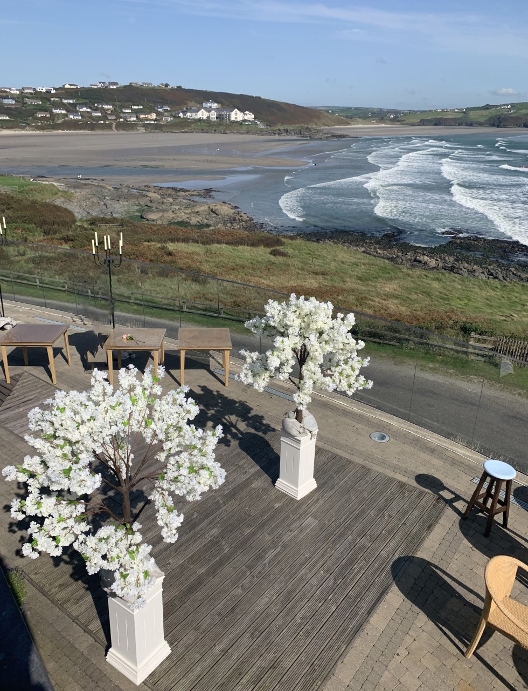
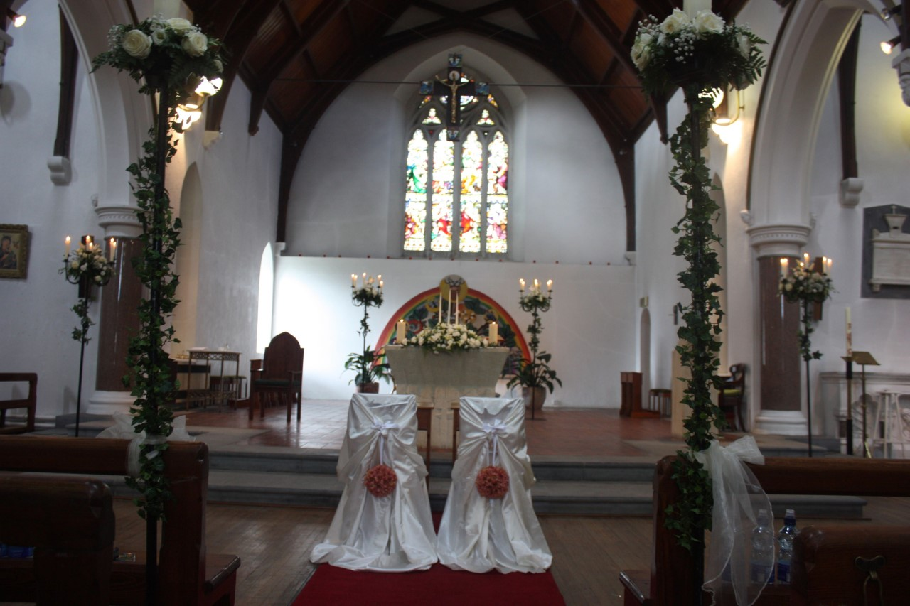
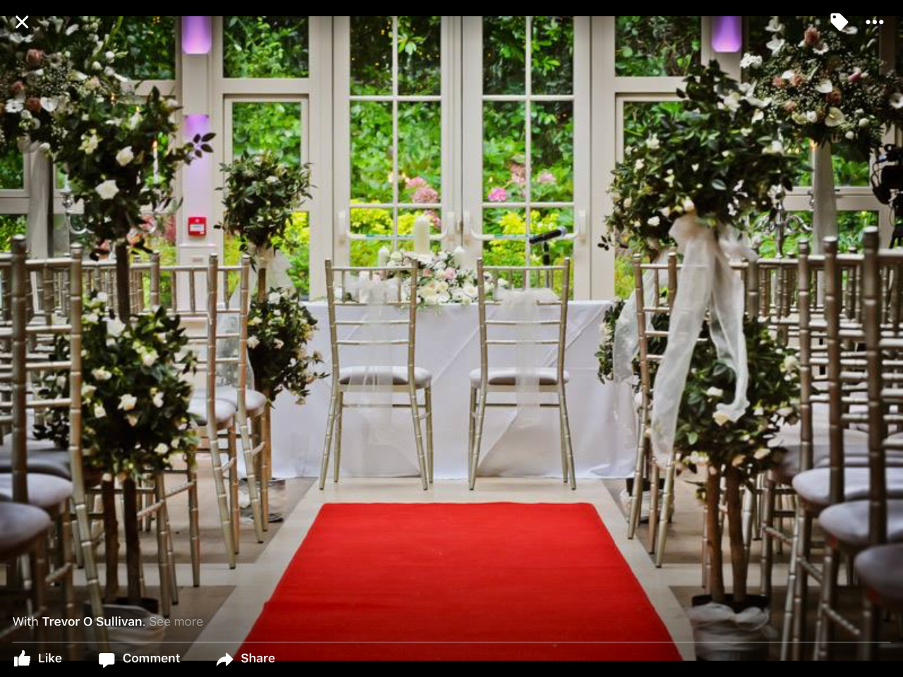
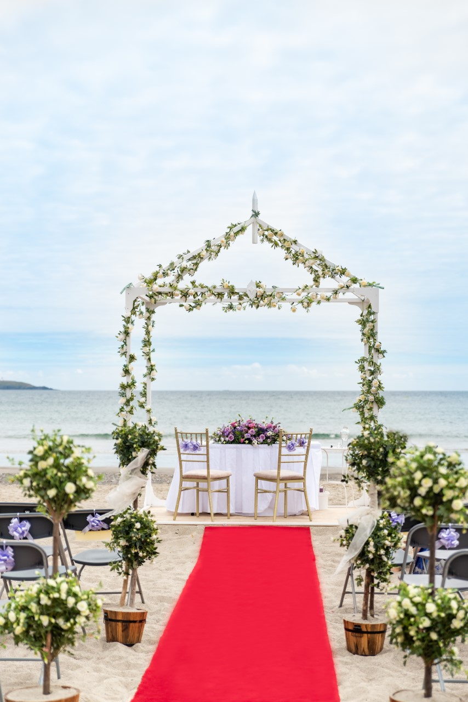

 <!DOCTYPE html>
<html>
<head>
<meta name="viewport" content="width=device-width, initial-scale=1">

	<link href='https://fonts.googleapis.com/css?family=Parisienne' rel='stylesheet'>
	 
<link rel="stylesheet" href="https://www.w3schools.com/w3css/4/w3.css">	   
	<body style="background-color:black;">
	 
  </style>

</head>
<body>

  <a class="active" href="#home">Home</a>
  
	<a href="Candles.html">Candles</a>
	<a href="Generalarrangements.html">General Arrangements</a>
    <a href="Prices.html">Price List</a>
    <a href="SocialMedia.html">Facebook</a>
	<a href="Instagram.html">Instagram</a>
    <a href="Contactme.html">Contact Me : Elizabeth Cott </a>
    

    <a href="#search">Wonderous Weddings</a>
	  
     
  

	

At Wonderous Weddings we offer relaxed one-to-one consultations with brides. With over fifteen years experience we are able to listen to a brides’ ideas and turn those dreams into reality.

Designer wedding floral consultants for all your Wedding Day needs.
Based in Cork, Ireland with over fifteen years experience.
Weddings catered for in the Munster region (Cork, Kerry, Limerick, Tipperary, Waterford)
Free after hours consultation for busy brides to be.
Working closely both for and with the bride for her most special and memorable day.
We especially cater for couples living overseas who intend to get married in Ireland.

 

<ul>Ceremonial Wonder
  <li>From Elegant to Enchanting</li>
  <li>From Retro to Romantic</li>
  <li>From Funky to Fabulous</li>
  <li>From Wow to Wonderous</li>
 <li>From Tropical to just downright Amazing</li>
 <li>Phone on 087-2118141 or 086-6078552</li>	
</ul>  
	
	 
<!-- !PAGE CONTENT! -->

  <!-- First Photo Grid-->
  

    

      
      <h3>Cherry Trees</h3>
      
    

    

      
		<h3>Church Decor</h3>
      
     
    

    

      
		<h3>Hotel Decor</h3>
    
      
      
    

    

      
      <h3>Outdoor Ceremony Decor </h3>
  
    

  

   

 
  
</body>
</html>
